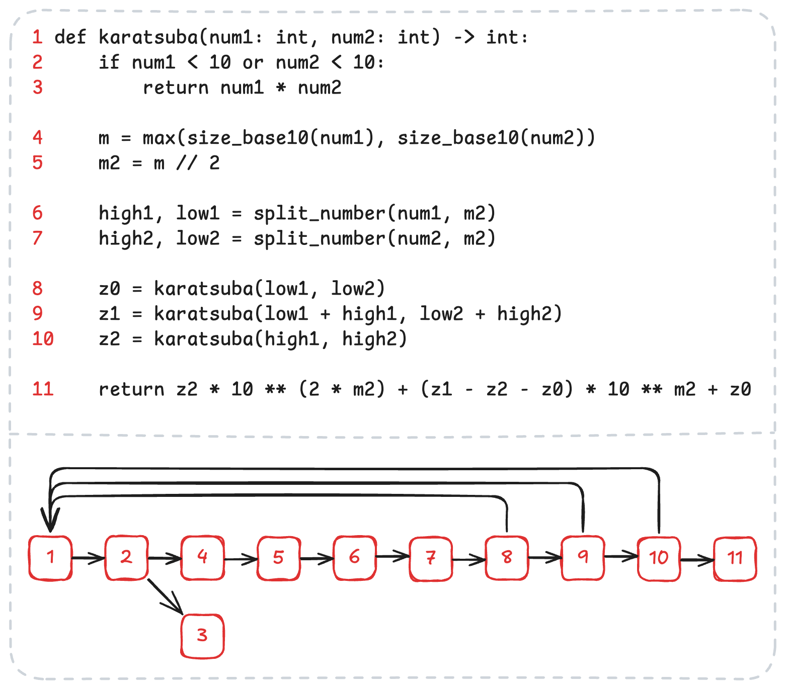

# Karatsuba Algorithm

Simple Python implementation of the Karatsuba algorithm for multiplying two numbers.

# About

The Karatsuba algorithm is a fast multiplication method that uses a divide-and-conquer approach to multiply large numbers more efficiently than the traditional grade-school method. Instead of performing O(n²) operations, it reduces the problem into three smaller multiplications of half-sized numbers, achieving a time complexity of O(n^log₂3) ≈ O(n^1.585). This efficiency makes it significantly faster for large inputs. The algorithm works by recursively splitting numbers into halves, computing three intermediate products, and combining them using addition and digit shifts. Its main advantage is that it reduces the number of multiplications needed, making it especially useful in cryptography, large integer arithmetic, and computer algebra systems.

# Structure

This repository contains three `.py` files:

- **karatsuba.py**: Contains the implementation of the Karatsuba algorithm.
- **test_karatsuba.py**: Contains unit tests for the Karatsuba algorithm.
- **main.py**: Contains an example of how to use the Karatsuba algorithm.

# How to run

You need to have Python 3 installed on your machine to run the code.

To run the example program, you can use the following command:

```bash
python3 main.py
```

To run the unit tests, you can use the following command:

```bash
python3 test_karatsuba.py
```

# Control flow graph



## Cyclomatic complexity

Considering 𝑀 = 𝐸 − 𝑁 + 2𝑃, where 𝐸 is the number of edges (13), 𝑁 is the number of nodes (11), and 𝑃 is the number of connected components (1), the cyclomatic complexity of the Karatsuba algorithm is **4**.

## Asymptotic complexity

- **Best case:** O(1), when one of the numbers has only one digit.
- **Average/Worst case:** O(n^log(3)) ≈ O(n^1.585), where n is the number of digits in the input numbers.
- **Space complexity:** O(n^log(3))